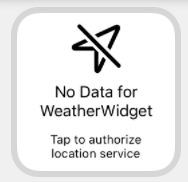

# Purpose of app
Design and Implement an app as a long term project

# Technology used
- CoreLocation
- SwiftUI
- Storyboard
- WidgetKit

# Developer's Build environment
- xcode 13.1, macOS BigSur 11.6, intel mac
- build target for main app: `weather`
- build target for widget: `weatherwidget`

Note: There are occasions that widget doesn't get location data properly in simulator. In that case, try to use a different simulator, and do not forget to configure to simulate location.

# Screenshots
  
  
  
  
  

# Architecture explaination
### Widget (weatherwidget)
Layered Architecture
1. Presentation Layer (Views)
2. Domain Layer (DTO)
3. Data Layer (Request, Repository, Entity)
4. Infrastructure Layer (FileStorage, APIRequestProtocol)

Note:
- Presentation layer can be further divided with View and ViewModel to improve understandable, flexible, and maintainable. This demo app is simplified for that part, but can be easily modified when future requirement is decided.
- classes like APIRequestProtocol, APIError is highly minimized for simplicity. In work environment, library like APIKit, Alamofire would be introduced for API handling cababilities.

### Main App (weather)
Note:
- Requirement for main app is very simple (without data handling) in main app, and hence a simple View-Controller pattern is used here for time and simplicity reason. If given more time, it can be further architected with MVP, MVVM to improve understandable, flexible, and maintainable. 
- Each screen with design is seperated by different storyboard for simplicity reason
- LargeWidgetVC, MediumWidget, SmallWidget is intentionally created seperately for extensibility on widget design change (which likely happens)

# Assumption on Requirement, and further improvement
- Widget would use actual current location, while main app use mock data (assuming that use case of main app is to customize appearance and change background image)

### Other Assumption
- Requirement states that widget should be updated every 1 minute, but due to os limitation of widget specification, location and weather data might be delayed as long as 15 minutes

### Edge Cases
- App unauthenticated or immediately after installing
  

- Address of location is unidentified
  

- Widget would keep unupdated if API request fails

### Improvement Suggestion on requirement
- (main app) loading speed of opening gallery is slow, a spinning activity indicator should be displayed
- (main app) a view on main app displaying instruction to prompt users to authorize location, if not authorized yet
- (widget) a different design of view for api error might be required

# Remarks: about Test Codes
- `struct weatherwidget_Previews: PreviewProvider` has covered different patterns for UIs
- test codes on infra.framework is in target `infraTests`
- test codes on DTO, Entity would be great if given enough time.
